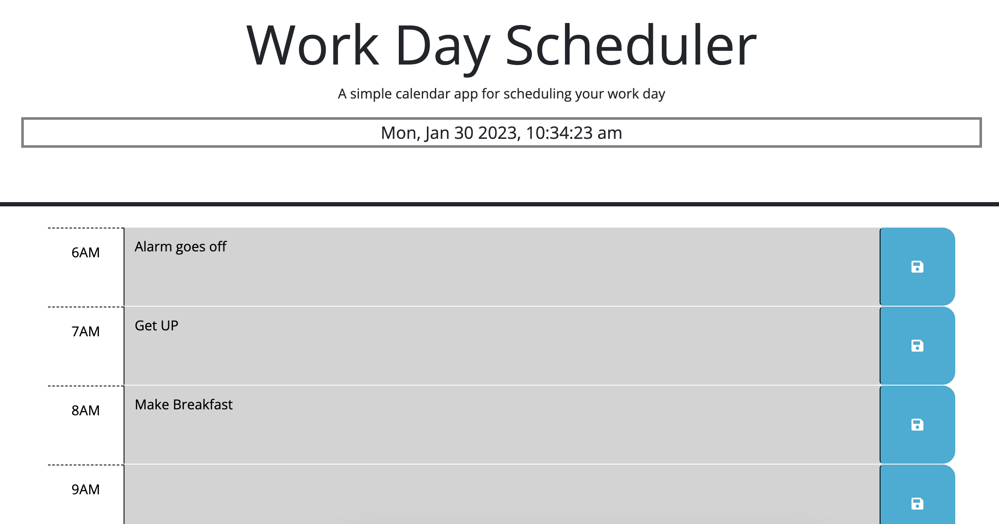
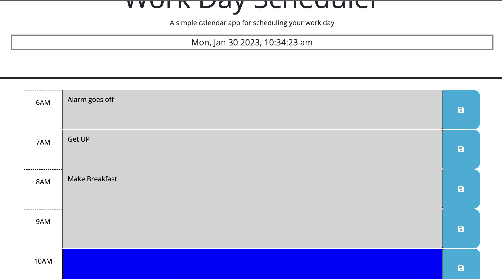

# 05 Work Day Scheduler - gcal_who

## Description

The intention of this website was to create that an individual could use as a simple daily planner. As the hours of the day go on, the colors of the hourly tabs change to signal the passing of time. This calendar was created using Web APIs, JavaScript, jquery, daysjs, Bootstrap, local storage, and good fonts. 

## Usage

A screenshot is included below of the site. The site images are saved locally and a screenshot is shown below.

A GitHub link is here: https://github.com/caseyfee/gCal_who
Live link: https://caseyfee.github.io/gCal_who/

## Credits

Big thanks to my fellow students, MDN documentation, and YouTubers.

